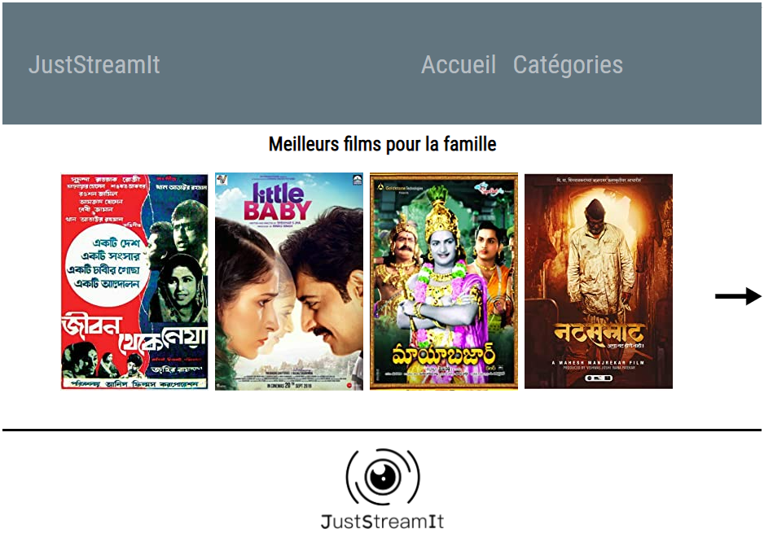

# JustStreamIt v1

**_Projet réalisé lors de ma formation de Développeur d'application Python à OpenClassrooms_**

 

* Web application JustStreamIt
* This website shows the best movie, a list of the 7 best movies and 3 lists of 7 movies ranked by categories.
* Is is coded in html5, CSS3 and JavaScript.
* It uses the API ocmovies-api-en.

## API OCMovies-API

* Assumption: API ocmovies-api-en is already installed from:
https://github.com/OpenClassrooms-Student-Center/OCMovies-API-EN-FR
* To run the server do the next 3 lines:
* Open a new windows 10 terminal with the cmd command in this directory.
* Activate the virtual environnement `env\Scripts\activate.bat`
* Run the server with `python manage.py runserver`

## Installation

* Assumption: Tested with Chrome, Firefox, Edge, Opera
* Dowload the package of the application from github, unzip and store it in a new directory.
* Note: If you run the API OCMovies-API not in port 8000, you must change the port in var url_api in main.js first line.
* Open file index.html in local in your favorite browser
